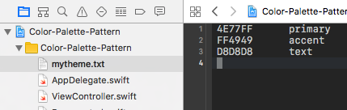
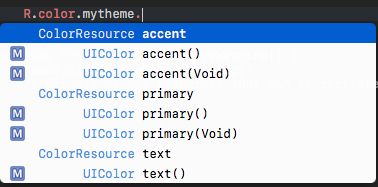
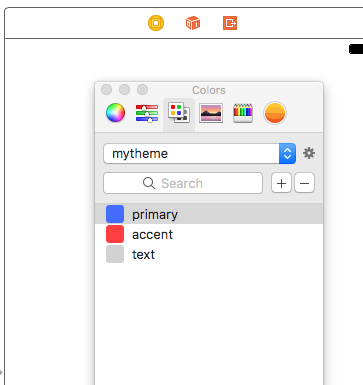

# Color Palette Pattern with R.swift

## Overview
This is a sample for using the same color scheme on source code and Interface Builder.
To use the defined color scheme from the source code, convert with [R.swift](https://github.com/mac-cain13/R.swift).
Also, in order to use it from Interface Builder, convert it to .clr file with [ColorTools](https://github.com/ramonpoca/ColorTools).

**Color theme definition**

**How to use from code**

**How to use from Interface Builder**

## Author

**R. Ayakix**

- Past works: [Product list](http://ayakix.com/) / [Waaaaay!](http://waaaaay.com/)
- Blogs: [English](https://medium.com/@Ayakix) / [Japanese](http://blog.ayakix.com/)
- Contact: [Twitter](https://twitter.com/ayakix)

## Acknowledgements
- [R.swift](https://github.com/mac-cain13/R.swift)
- [ColorTools](https://github.com/ramonpoca/ColorTools)
